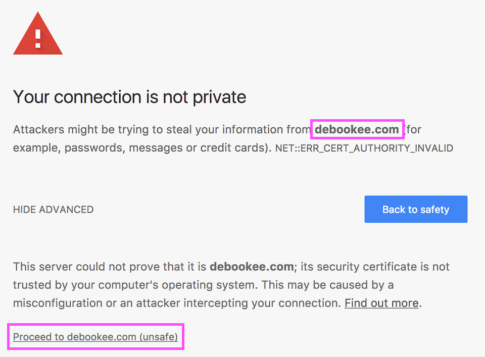
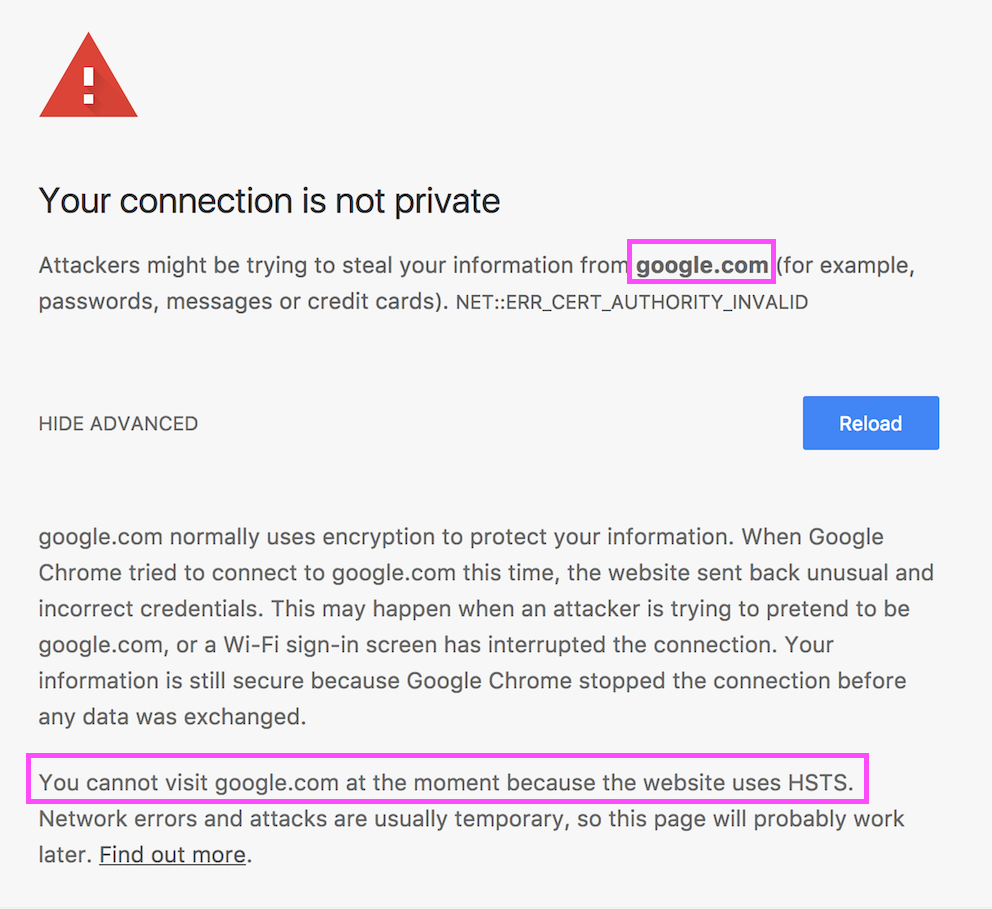

.. include:: global.rst

.. _module_ssl_long:

SSL --- SSL/TLS Decryption Module
===============================

The SSL module is an extension of :ref:`module_na` which allows HTTPS decryption of your own traffic and :ref:`intercepted targets <mitm>` by setting an HTTPS man-in-the-middle proxy.

By default, TLS decryption is not enabled. Debookee can run in 3 modes:

    * No TLS decryption
    * TLS decryption for targets only
    * TLS decryption for Own Traffic and all the intercepted targets

How it works
------------

    #. We intercept the client HTTPS connection (*Client->Debookee*)
    #. Create it's own HTTPS connection to the server (*Debookee->Server*)
    #. Retrieve some data from the server & decrypt them
    #. Create on-the-fly a fake certificate impersonating the server, created from Debookee's Certificate Authority (CA)
    #. Send the fake certificate to the client and establish *Client->Debookee* TLS connection
    #. Send the data to the client

Clients SSL/TLS warnings/failures
---------------------------------

Most HTTPS clients (browsers, applications, email clients...) will detect Debookee's fake certificates and will behave differently, depending their capabilities.

A solution to avoid those warnings can be the :ref:`installation of Debookee's Certificate Authority <module_ssl_ca_install>` on the client.

By default, without Debookee's CA, reactions to the fake certificate could be:

    #. Clients present a warning and propose to accept the fake certificate
    #. Clients present a fatal alert and deny the connection in case of Key Pinning
    #. Clients TLS connections fails silently
    

Examples
********

    CA certificate is not installed on client and debookee.com doesn't implement Key Pinning -> Chrome proposes you to proceed with fake certificate

    
    CA certificate is not installed on client and google.com uses Key Pinning -> no way to access the website
    
    
.. _module_ssl_key_pinning:

Key Pinning
-----------
Some clients implements `HTTP Public Key Pinning <https://en.wikipedia.org/wiki/HTTP_Public_Key_Pinning>`_, a security mechanism which prevents impersonation of a TLS server.

Key Pinning can be strict or not. When strict, even if the CA is installed, the client won't accept to establish the impersonated TLS connection.
In a future release, Debookee will implement a white-list to avoid decryption of some connections involving strict Key Pinning.

.. _module_ssl_ca_install:

Installation of Debookee's Certificate Authority (CA)
-----------------------------------------------------

.. _module_ssl_target_traffic_decryption:

Target traffic decryption
*************************

If you intercept a target traffic and want to decrypt its traffic, by default, the client's browser will warn you of the MITM attempt.
In that case, you need to install the Debookee's Certificate Authority on the target (not on the Mac running Debookee).

You can access the certificate with the following steps:

    #. Select a target
    #. Start NA module, target's traffic must be intercepted
    #. On the target, run a browser on ``http://mitm.it:6969``
    #. Follow the steps on the following website to install the CA on the target
    
.. image:: img/module_ssl_certinstall_webpage.png

The webpage is proposed by `mitmproxy <https://mitmproxy.org>`_ which is internally used in Debookee for the SSL/TLS decryption. |br|
If you want to learn more about this incredible project, you can checkout their very complete `documentation. <https://docs.mitmproxy.org>`_.

.. _module_ssl_own_traffic_decryption:

Own Traffic decryption
**********************

To decrypt your Own Traffic without browser's warnings, you need to install the CA on the Mac running Debookee. |br|
You don't need to manually install certificate in the Keychain, this can be done automatically in Debookee by pressing ``Add CA cert to Keychain``.

Press ``Remove CA cert from Keychain`` to disable automatic decryption of your traffic and bring back warnings.

If you need to have access to the certificates for :ref:`module_ssl_private_cert_store`, life for targets, you can browse ``http://mitm.it:6969`` from a browser on the Mac running Debookee.

.. _module_ssl_private_cert_store:

Private certificate store
*************************

:ref:`module_ssl_target_traffic_decryption` and :ref:`module_ssl_own_traffic_decryption` allows you to install a CA certificate into the system certificate store of the OS. (macOS Keychain, Windows, Android certificate store, etc ...)

Some applications are not using the OS certificate store, but instead have their own, like Firefox or Thunderbird.

In that case, you will have to install manually Debookee's CA certificate inside the private certificate store. |br|
You'll find the CA file by downloading it from ``http://mitm.it:6969``.

